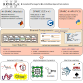

# SPARC-X-API: A Python API for the SPARC-X DFT Code
[](https://raw.githubusercontent.com/SPARC-X/SPARC-X-API/badges/badges/package.svg)
[](https://raw.githubusercontent.com/SPARC-X/SPARC-X-API/badges/badges/coverage.svg)
[](https://github.com/SPARC-X/SPARC-X-API/actions/workflows/unit_test.yml)
[](https://raw.githubusercontent.com/SPARC-X/SPARC-X-API/master/sparc/sparc_json_api/parameters.json)
[](https://sparc-x.github.io/SPARC-X-API/)


SPARC-X-API is a versatile Python API for the real-space density
functional (DFT) package [SPARC](https://github.com/SPARC-X/SPARC)
distributed under the GPLv3 license.  SPARC-X-API leverages the
powerful Atomic Simulation Environment
([ASE](https://wiki.fysik.dtu.dk/ase/)) framework for manipulating
input / output files, as well as running DFT calculations and analysis
via the SPARC code written in C/C++. Key features include:

1. ASE-compatible I/O format for SPARC files
2. A JSON Schema interfacing with SPARC's C/C++ code for parameter validation and conversion
3. A comprehensive calculator interface for SPARC with file I/O and socket-communication support.

## Overview

SPARC-X-API is part of the [SPARC-X
project](https://github.com/SPARC-X), a collection of open-source
packages aim to provide modern and efficient implementation of real
space DFT simulations, led by the research groups of Phanish
Suryanarayana and Andrew J. Medford from Georgia Tech. The name SPARC
stands for **S**imulation **P**ackage for **A**b-initio
**R**eal-**S**pace **C**alculations, which comes in two variations:
- [**M-SPARC**](https://github.com/SPARC-X/M-SPARC): self-consistent
  Matlab code for algorithm prototyping and testing
- [**SPARC**](https://github.com/SPARC-X/SPARC): C/C++ implementation
  of efficient production code scaling up to millions of atoms

The SPARC-X project shares common input / output file formats, and
parameter specification. SPARC-X-API serves as the interface that
connects the core SPARC-X components with external workflows, as
illustrated in the diagram below.




## Quick start

SPARC-X-API is straightforward to install and use, adhering to the ASE
standard for seamless integration into other computational workflows.

### Installation

Install SPARC-X-API via
[`conda`](https://docs.conda.io/projects/conda/en/latest/index.html).
```bash
conda install -c conda-forge sparc-x-api
```

Install the pre-compiled SPARC binary alongside SPARC-X-API (Linux only).
```bash
conda install -c conda-forge sparc-x
```

### Reading / Writing SPARC files

SPARC-X-API provides a file format `sparc` compatible with the ASE
`ioformat`, which treats the calculation directory containing SPARC
in-/output files as a bundle:

- Read from a SPARC bundle
```python
from ase.io import read
atoms = read("sparc_calc_dir/", format="sparc")
```

- Write input files
```python
from ase.build import Bulk
atoms = Bulk("Al") * [4, 4, 4]
atoms.write("sparc_calc_dir/", format="sparc")
```

### Visualizing Atomic Structures in SPARC Files

You can use the `ase gui` commandline tool to visualize SPARC files:

```bash
ase gui sparc_calc_dir/*.ion
```

### Parameter Validation with JSON Schema

SPARC-X-API allows user to validate SPARC parameters based on a JSON
schema that is parsed from the [LaTeX
documentation](https://github.com/SPARC-X/SPARC/tree/master/doc) of
the SPARC-X project. To get help for a specific parameter:

```python
from sparc.api import SparcAPI
print(SparcAPI().help_info("LATVEC"))
```

### Running SPARC Calculations

SPARC-X-API provides two ways to run a DFT calculation via SPARC C/C++ code:

1. **File I/O mode**: classic way to drive SPARC calculation by
   running a standard SPARC process with input files. Suitable for
   things implemented internally in SPARC C/C++ codes:
   - Single point evaluation
   - Band structure calculations
   - Structural optimization (SPARC internal routines)
   - Ab-init molecular dynamics (AIMD)

2. **Socket mode**: run a background SPARC process while providing
   atomic positions and other data via socket communication. Suitable for:
   - Hundreds / thousands of single point DFT evaluations
   - Integration with complex algorithms / workflows
   - Combination with internal and external machine learning (ML)
     force fields

The calculator interface in SPARC-X-API is designed to be intuitive
for users familiar with the ASE calculator interfaces for other DFT
packages (e.g. VASP, Quantum ESPRESSO, GPAW, Abinit, etc):

#### File I/O mode

Run a single point DFT calculation with Dirichlet boundary conditions:
```python
from sparc.calculator import SPARC
from ase.build import molecule
atoms = molecule("H2", cell=(10, 10, 10), pbc=False, directory="run_sp")
atoms.calc = SPARC(h=0.25) # 0.25 Å mesh spacing
atoms.get_potential_energy()
atoms.get_forces()
```

#### Socket mode

Switching to the socket mode requires just a few parameters, ideal for
workflows with hundreds or thousands of single point DFT calls with
much less overhead and more flexibility. An example for optimization
using socket mode and ASE optimizer:

```python
from sparc.calculator import SPARC
from ase.build import molecule
from ase.optimize import BFGS
atoms = molecule("H2", cell=(10, 10, 10), pbc=False, directory="run_sp")
atoms.center()
atoms.calc = SPARC(h=0.25, use_socket=True) # 0.25 Å mesh spacing
opt = BFGS(atoms)
with atoms.calc:
    opt.run(fmax=0.01)
```

## Documentation
Please check the [full
documentation](https://sparc-x.github.io/SPARC-X-API) for details
regarding installation, usage, troubleshooting and contribution
guidelines.

## How to cite
If you find SPARC-X-API help, please consider cite the relevant
publications below:
- The SPARC-X-API package itself: [Tian et al. 2024]() **TBD**
- The SPARC C/C++ code
  - v2.0 [Zhang et al., 2024](https://doi.org/10.1016/j.simpa.2024.100649)
  - v1.0 [Xu et al., 2021](https://doi.org/10.1016/j.softx.2021.100709)
- The M-SPARC Matlab code
  - v2.0 [Zhang et al., 2023](https://doi.org/10.1016/j.softx.2022.101295)
  - v1.0 [Xu et al., 2020](https://doi.org/10.1016/j.softx.2020.100423)

For a full list of publications in the SPARC-X project please refer to:
- [SPARC developement](https://github.com/SPARC-X/SPARC?tab=readme-ov-file#6-citation)
- [M-SPARC development](https://github.com/SPARC-X/M-SPARC?tab=readme-ov-file#6-citation)
- [Pseudopotentials](https://github.com/SPARC-X/SPMS-psps?tab=readme-ov-file#citation)

## Acknowledgment
The development of SPARC-X-API is supported by the U.S. Department of
Energy, Office of Science, under Grant No. DE-SC0019410 and
DE-SC0023445.
