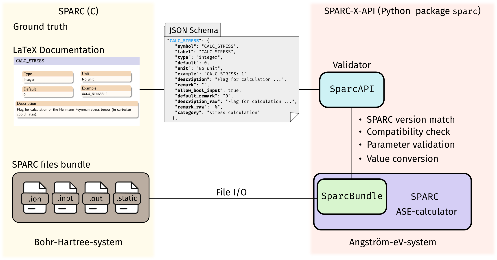

# SPARC-X-API: A Python API for the SPARC-X DFT Code

SPARC-X-API is a versatile Python API for the real-space density
functional (DFT) package [SPARC](https://github.com/SPARC-X/SPARC)
(**S**imulation **P**ackage for **A**b-initio **R**eal-**S**pace
**C**alculations) distributed under the GPLv3 license.
SPARC-X-API
leverages the powerful Atomic Simulation Environment
([ASE](https://wiki.fysik.dtu.dk/ase/)) framework for manipulating
input / output files, as well as running DFT calculations and analysis
via the SPARC code written in C/C++. Key features include:

1. ASE-compatible I/O format for SPARC files
2. A JSON Schema interfacing with SPARC's C/C++-code for parameter validation and conversion
3. A comprehensive calculator interface for SPARC with file I/O and socket-communication support.

## Quick start

## How to cite
If you find SPARC-X-API help, please consider cite the relevant
publications below:
- **TBD** To cite the SPARC-X-API package itself: **TBD JOSS**
- The SPARC C/C++ code
  - v2.0 [Zhang 2024](https://doi.org/10.1016/j.simpa.2024.100649)
  - v1.0 [Xu 2021](https://doi.org/10.1016/j.softx.2021.100709)
- The M-SPARC Matlab code
  - v2.0 [Zhang 2023](https://doi.org/10.1016/j.softx.2022.101295)
  - v1.0 [Xu 2020](https://doi.org/10.1016/j.softx.2020.100423)

For a full list of publications in the SPARC-X project please refer to:
- [SPARC developement](https://github.com/SPARC-X/SPARC?tab=readme-ov-file#6-citation)
- [M-SPARC development](https://github.com/SPARC-X/M-SPARC?tab=readme-ov-file#6-citation)
- [Pseudopotentials](https://github.com/SPARC-X/SPMS-psps?tab=readme-ov-file#citation)

## Acknowledgment
The authors gratefully acknowledge the support of the U.S. Department
of Energy, Office of Science, under Grant No. DE-SC0019410 and
DE-SC0023445.

<!-- [Fig. 1](#fig-1-schematic-drawing-for-the-architecture-of-the-sparc-x-api-package) provides an overlook of the components of `SPARC-X-API` and its relation with the SPARC C-code. -->

<!-- #### Fig. 1 Schematic drawing for the architecture of the `SPARC-X-API` package -->
<!--  -->

<!-- ## Troubleshooting -->
<!-- Please refer to the [troubleshooting](doc/troubleshooting.md) guidelines -->

<!-- ## Advanced topics -->
<!-- A detailed description about how the API works can be found [here](doc/advanced_topics.md) -->

<!-- ## API changes -->
<!-- The API changes compared to the older release ([v0.1](https://github.com/SPARC-X/SPARC-X-API/tree/eac557f214b402122a506f88f38c7a8767283503)) are summarized [here](doc/changes_v0.1.md) -->

<!-- ## How to contribute -->
<!-- Please refer to our [guidelines for contributors](doc/contribution_guideline.md) -->
