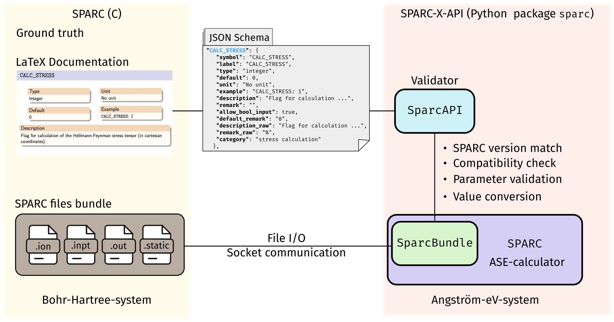

# SPARC-X-API: A Python API for the SPARC-X DFT Code
[](https://raw.githubusercontent.com/SPARC-X/SPARC-X-API/badges/badges/package.svg)
[](https://raw.githubusercontent.com/SPARC-X/SPARC-X-API/badges/badges/coverage.svg)
[](https://github.com/SPARC-X/SPARC-X-API/actions/workflows/installation_test.yml)
[](https://raw.githubusercontent.com/SPARC-X/SPARC-X-API/badges/badges/api_version.svg)


SPARC-X-API is a versatile Python API for the real-space density
functional (DFT) package [SPARC](https://github.com/SPARC-X/SPARC)
(**S**imulation **P**ackage for **A**b-initio **R**eal-**S**pace
**C**alculations) distributed under the GPLv3 license.
SPARC-X-API
leverages the powerful Atomic Simulation Environment
([ASE](https://wiki.fysik.dtu.dk/ase/)) framework for manipulating
input / output files, as well as running DFT calculations and analysis
via the SPARC code written in C/C++. Key features include:

1. ASE-compatible I/O format for SPARC files
2. A JSON Schema interfacing with SPARC's C/C++ code for parameter validation and conversion
3. A comprehensive calculator interface for SPARC with file I/O and socket-communication support.

##

## Quick start

SPARC-X-API is straightforward to install and use, adhering to the ASE
standard for seamless integration into other computational workflows.

### Installation

We recommend to use the
[`conda`](https://docs.conda.io/projects/conda/en/latest/index.html)
for installation on UNIX systems.
```bash
conda install -c conda-forge sparc-x-api
```

You can also install the pre-compiled SPARC binary alongside SPARC-X-API (Linux only).
```bash
conda install -c conda-forge sparc-x
```

More installation options please see documentations for [installation]() and
[environment setup]().

### Reading / Writing SPARC files

SPARC-X-API provides a file format `sparc` compatible with the ASE
`ioformat`, which treats the calculation directory containing SPARC
in-/output files as a bundle:

- Read from a SPARC bundle
```python
from ase.io import read
atoms = read("sparc_calc_dir/", format="sparc")
```

- Write input files
```python
from ase.build import Bulk
atoms = Bulk("Al") * [4, 4, 4]
atoms.write("sparc_calc_dir/", format="sparc")
```

### Visualizing Atomic Structures in SPARC Files

You can use the `ase gui` commandline tool to visualize SPARC files:

```bash
ase gui sparc_calc_dir/*.ion
```

### Parameter Validation with JSON Schema

SPARC-X-API allows user to validate SPARC parameters based on a JSON
schema that is parsed from the [LaTeX
documentation](https://github.com/SPARC-X/SPARC/tree/master/doc) of
the SPARC-X project. To get help for a specific parameter:

```python
from sparc.api import SparcAPI
print(SparcAPI().help_info("LATVEC"))
```

### Running SPARC Calculations

SPARC-X-API provides two ways to run a DFT calculation via SPARC C/C++ code:

1. **File I/O mode**: generate input files, run a standard SPARC
   process and read results until calculation finishes. Suitable for:
   - Single point evaluation
   - Band structure calculations
   - Structural optimization (SPARC internal routines)
   - Ab-init molecular dynamics (AIMD)

2. **Socket mode**: run a background SPARC process while providing
   atomic positions and other data via socket communication. Suitable for:
   - Hundreds / thousands of single point DFT evaluations
   - Integration with complex algorithms / workflows
   - Combination with internal and external machine learning (ML)
     force fields

The calculator interface in SPARC-X-API is designed to be intuitive
for users familiar with the ASE calculator interfaces for other DFT
packages (e.g. VASP, Quantum ESPRESSO, GPAW, Abinit, etc):

#### File I/O mode

Run a single point DFT calculation with Dirichlet boundary conditions:
```python
from sparc.calculator import SPARC
from ase.build import molecule
atoms = molecule("H2", cell=(10, 10, 10), pbc=False, directory="run_sp")
atoms.calc = SPARC(h=0.25) # 0.25 Å mesh spacing
atoms.get_potential_energy()
atoms.get_forces()
```

<!-- The file I/O mode is capable of running single point DFT calculations, -->
<!-- geometric optimization (using SPARC's internal routines), Ab-init -->
<!-- molecular dynamics (AIMD). Optimization and AIMD tasks may also -->
<!-- benefit from the built-in machine learning force field (MLFF) module. -->

#### Socket mode

With just a few parameters, you can switch to the socket mode, ideal
for evaluating hundreds or thousands of single point DFT energy and
forces with much less overhead and more flexibility compared with the
file I/O mode:

```python
from sparc.calculator import SPARC
from ase.build import molecule
from ase.optimize import BFGS
atoms = molecule("H2", cell=(10, 10, 10), pbc=False, directory="run_sp")
atoms.center()
atoms.calc = SPARC(h=0.25, use_socket=True) # 0.25 Å mesh spacing
opt = BFGS(atoms)
with atoms.calc:
    opt.run(fmax=0.01)
```


## How to cite
If you find SPARC-X-API help, please consider cite the relevant
publications below:
- The SPARC-X-API package itself: [Tian et al. 2024]() **TBD**
- The SPARC C/C++ code
  - v2.0 [Zhang et al., 2024](https://doi.org/10.1016/j.simpa.2024.100649)
  - v1.0 [Xu et al., 2021](https://doi.org/10.1016/j.softx.2021.100709)
- The M-SPARC Matlab code
  - v2.0 [Zhang et al., 2023](https://doi.org/10.1016/j.softx.2022.101295)
  - v1.0 [Xu et al., 2020](https://doi.org/10.1016/j.softx.2020.100423)

For a full list of publications in the SPARC-X project please refer to:
- [SPARC developement](https://github.com/SPARC-X/SPARC?tab=readme-ov-file#6-citation)
- [M-SPARC development](https://github.com/SPARC-X/M-SPARC?tab=readme-ov-file#6-citation)
- [Pseudopotentials](https://github.com/SPARC-X/SPMS-psps?tab=readme-ov-file#citation)

## Documentation

Please check the [full
documentation](https://sparc-x.github.io/sparc-x-api) for details
regarding installation, usage, troubleshooting and contribution
guidelines.

## Acknowledgment
The authors gratefully acknowledge the support of the U.S. Department
of Energy, Office of Science, under Grant No. DE-SC0019410 and
DE-SC0023445.


<!-- [Fig. 1](#fig-1-schematic-drawing-for-the-architecture-of-the-sparc-x-api-package) provides an overlook of the components of `SPARC-X-API` and its relation with the SPARC C-code. -->

<!-- #### Fig. 1 Schematic drawing for the architecture of the `SPARC-X-API` package -->
<!--  -->


<!-- ## Troubleshooting -->
<!-- Please refer to the [troubleshooting](doc/troubleshooting.md) guidelines -->

<!-- ## Advanced topics -->
<!-- A detailed description about how the API works can be found [here](doc/advanced_topics.md) -->

<!-- ## API changes -->
<!-- The API changes compared to the older release ([v0.1](https://github.com/SPARC-X/SPARC-X-API/tree/eac557f214b402122a506f88f38c7a8767283503)) are summarized [here](doc/changes_v0.1.md) -->

<!-- ## How to contribute -->
<!-- Please refer to our [guidelines for contributors](doc/contribution_guideline.md) -->
