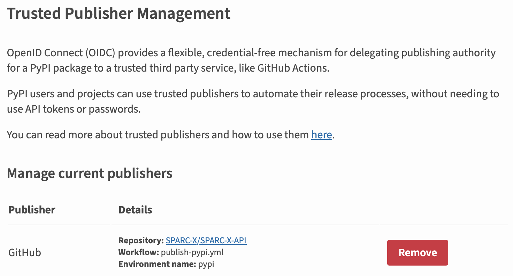

# Documentation for Maintainers

This part contains maintenance guidelines for SPARC-X-API core
developers. For general guidelines regarding how to contribute to this
project please refer to the [how to contribute](contribute.md) page.

Most of the tasks in this documentation require `maintain` or `admin`
role for the repository.

## Github Settings
### Remote Branches

There are multiple branches required for the CI/CD workflow in
SPARC-X-API. Push / pull request to these branches should only be made by automatic github actions.

- [`badges`](https://github.com/SPARC-X/SPARC-X-API/tree/badges):
  branch for maintaining the svg badges (package version, CI status,
  etc.)

  A list of svg badges can be found under `badges/` directory of this
  branch.

  See **TODO** for how to add / modify badges to be shown in
  the README.

- [`gh_pages`](https://github.com/SPARC-X/SPARC-X-API/tree/gh_pages):
  branch to publish the documentation site.

### Github Pages

To allow pushed to the `gh_pages` branches to be automatically
deployed to the document pages, go to the [pages
setting](https://github.com/SPARC-X/SPARC-X-API/settings/pages) and
set the "Source" to "Deploy from a branch", as well as "Branch" to
"gh_pages", as shown in the UI screenshot below:

### Secrets

Environment secrets (such as PyPI access key) can be configured in the
[secrets
setting](https://github.com/SPARC-X/SPARC-X-API/settings/secrets/actions)
panel. Please check the [github
documentation](https://docs.github.com/en/actions/security-for-github-actions/security-guides/using-secrets-in-github-actions)
for more details.

## Managing CI/CD Pipelines

CI/CD pipelines in the SPARC-X-API repo are managed by Github
workflows, consisting of multiple "Actions". Workflow configuration
YAML files are placed under `.github/workflows/` and the workflow
status can be checked at the [Actions
page](https://github.com/SPARC-X/SPARC-X-API/actions).  Please take a
look at the official [documentation for
actions](https://docs.github.com/en/actions) to get familiar with the syntax.

All workflows in the SPARC-X-API are designed to be able to run from
manual dispatch (with the `workflow_dispatch` enabled in the YAML
files) for debug purposes, from the "Run workflow" drop panel in the
[actions
page](https://github.com/SPARC-X/SPARC-X-API/actions/workflows), as
shown in the screenshot below:

- [Unit-test
  workflow](https://github.com/SPARC-X/SPARC-X-API/blob/master/.github/workflows/unit_test.yml)
  includes several steps to run unit and coverage test.

  - The steps `Create badges` and `  Manually add git badges` defines how
    the status badges in `README.md` are created and pushed to the
    `badges` branch.
  - When adding unit test examples involving real SPARC calculations,
    do not use more than 4 MPI cores (may subject to changes) due to
    the [resource limitation](https://docs.github.com/en/actions/using-github-hosted-runners/using-github-hosted-runners/about-github-hosted-runners)
    of hosted runners.

- [Publish doc pages
  workflow](https://github.com/SPARC-X/SPARC-X-API/blob/master/.github/workflows/publish_doc_pages.yml)
  uses Sphinx to convert `doc/` to doc html files.

  The rendered
  changes will only be pushed to the `gh_pages` branch with direct
  commit on the master branch or after one PR is merged.

- [Update JSON schema
  workflow](https://github.com/SPARC-X/SPARC-X-API/blob/master/.github/workflows/update_api.yml)
  updates the JSON schema file after a new release in SPARC C/C++
  source code.

  The workflow is run both nightly and after normal push. Change the
  behavior as needed.

- [Publish PyPI
  workflow](https://github.com/SPARC-X/SPARC-X-API/blob/master/.github/workflows/publish-pypi.yml)
  package the source as `sparc-x-api` and publish on PyPI. Only
  activates on new releases.

## Deploy on conda-forge

### Managing SPARC-X-API Python Package on conda-forge

SPARC-X-API is packaged as
[`sparc-x-api`](https://anaconda.org/conda-forge/sparc-x-api) in the
conda-forge channel. The source code (feedstock) for the package is
managed at
[`sparc-x-api-feedstock`](https://github.com/conda-forge/sparc-x-api-feedstock).
Please note that this repository is under the conda-forge
organization. If you wish to become a maintainer, please ping
[@alchem0x2a](https://github.com/alchem0x2A).

The feedstock is set to track new releases in SPARC-X-API, and usually
no major maintenance is required. The bot system will create a PR for
a version bump, see [one
example](https://github.com/conda-forge/sparc-x-api-feedstock/pull/2)
for the maintainers to modify and merge. Please also ensure:

- Only the `recipe/meta.yaml` needs to be changed.
- Follow the conda-forge's own [recipe standard](https://conda-forge.org/docs/maintainer/guidelines/)
- Do not directly use the [`.conda/meta.yaml`](https://github.com/SPARC-X/SPARC-X-API/blob/master/.conda/meta.yaml) for conda-forge (it is designed for local packaging test)
- Bump the `build.number` if you need to change the recipe YAML on the same SPARC-X-API release.

### Managing SPARC C/C++ Package on conda-forge

The conda-forge [`sparc-x`](https://anaconda.org/conda-forge/sparc-x)
package is managed by the
[`sparc-x-feedstock`](https://github.com/conda-forge/sparc-x-feedstock). The
maintenance rules are similar to `sparc-x-api-feedstock`. There are
several issues for future releases:
- Allow fetching dated releases of SPARC C/C++ code
- Add more build variants for MKL and MPICH

## Deploy on PyPI

SPARC-X-API is deployed on PyPI under the name
[`sparc-x-api`](https://pypi.org/project/sparc-x-api/). Please contact
the current maintainer [@alchem0x2a](mailto:alchem0x2a@gmail.com) if
you wish to become a co-contributor.

Publishing on PyPI does not require setting an API token in the CI
workflow. Instead, it uses the [OIDC
protocol](https://docs.pypi.org/trusted-publishers/) for a trusted
publisher. The current settings on PyPI are like follows:

