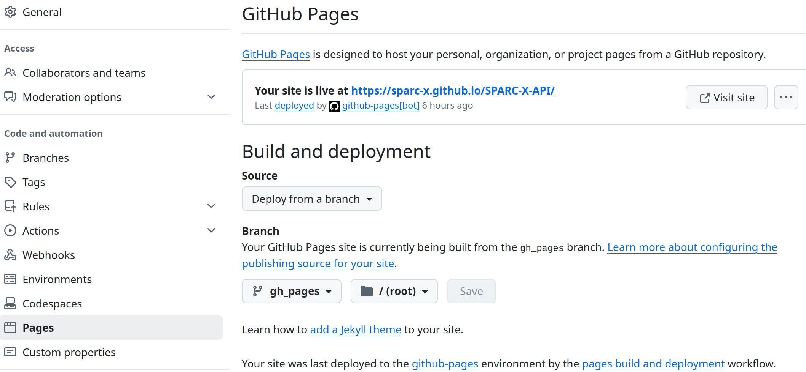
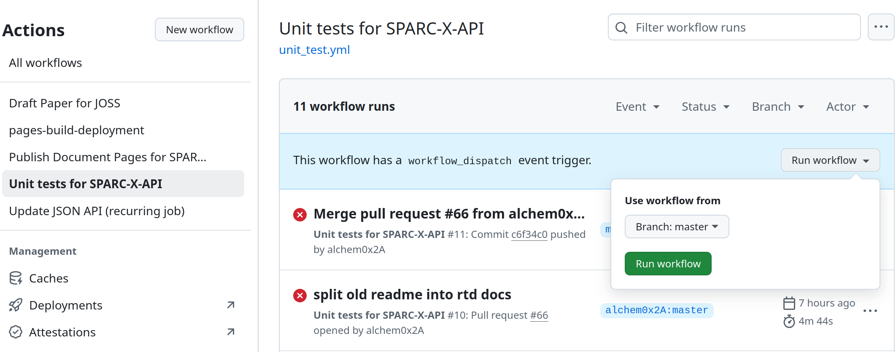

## Github Settings
### Remote Branches

There are multiple branches required for the CI/CD workflow in
SPARC-X-API. Push / pull request to these branches should only be made by automatic github actions.

- [`badges`](https://github.com/SPARC-X/SPARC-X-API/tree/badges):
  branch for maintaining the svg badges (package version, CI status,
  etc.)

  A list of svg badges can be found under `badges/` directory of this
  branch. See [the development guide](#doc-edit) for how to add /
  modify badges to be shown in the README.

- [`gh_pages`](https://github.com/SPARC-X/SPARC-X-API/tree/gh_pages):
  branch to publish the documentation site.


### Github Pages

To allow pushed to the `gh_pages` branches to be automatically
deployed to the document pages, go to the [pages
setting](https://github.com/SPARC-X/SPARC-X-API/settings/pages) and
set the "Source" to "Deploy from a branch", as well as "Branch" to
"gh_pages", as shown in the UI screenshot below:




### Secrets

Environment secrets (such as PyPI access key) can be configured in the
[secrets
setting](https://github.com/SPARC-X/SPARC-X-API/settings/secrets/actions)
panel. Please check the [github
documentation](https://docs.github.com/en/actions/security-for-github-actions/security-guides/using-secrets-in-github-actions)
for more details.

(cicd-sparc-x-api)=
## Managing CI/CD Pipelines

CI/CD pipelines in the SPARC-X-API repo are managed by Github
workflows, consisting of multiple "Actions". Workflow configuration
YAML files are placed under `.github/workflows/` and the workflow
status can be checked at the [Actions
page](https://github.com/SPARC-X/SPARC-X-API/actions).  Please take a
look at the official [documentation for
actions](https://docs.github.com/en/actions) to get familiar with the syntax.

All workflows in the SPARC-X-API are designed to be able to run from
manual dispatch (with the `workflow_dispatch` enabled in the YAML
files) for debug purposes, from the "Run workflow" drop panel in the
[actions
page](https://github.com/SPARC-X/SPARC-X-API/actions/workflows), as
shown in the screenshot below:



- [Unit-test
  workflow](https://github.com/SPARC-X/SPARC-X-API/blob/master/.github/workflows/unit_test.yml)
  includes several steps to run unit and coverage test.

  - The steps `Create badges` and `  Manually add git badges` defines how
    the status badges in `README.md` are created and pushed to the
    `badges` branch.
  - When adding unit test examples involving real SPARC calculations,
    do not use more than 4 MPI cores (may subject to changes) due to
    the [resource limitation](https://docs.github.com/en/actions/using-github-hosted-runners/using-github-hosted-runners/about-github-hosted-runners)
    of hosted runners.

- [Publish doc pages
  workflow](https://github.com/SPARC-X/SPARC-X-API/blob/master/.github/workflows/publish_doc_pages.yml)
  uses Sphinx to convert `doc/` to doc html files.

  The rendered
  changes will only be pushed to the `gh_pages` branch with direct
  commit on the master branch or after one PR is merged.

- [Update JSON schema
  workflow](https://github.com/SPARC-X/SPARC-X-API/blob/master/.github/workflows/update_api.yml)
  updates the JSON schema file after a new release in SPARC C/C++
  source code. The workflow is run both nightly and after normal
  push. You can change the behavior as needed.

  An example pull request created by the update workflow can be seen
  in the following screenshot:

  ```{figure} ../img/screenshots/api_update_pr_github.png
  :alt: PR on github
  ```

  Once the

- [Publish PyPI
  workflow](https://github.com/SPARC-X/SPARC-X-API/blob/master/.github/workflows/publish-pypi.yml)
  package the source as `sparc-x-api` and publish on PyPI. Only
  activates on new releases.
